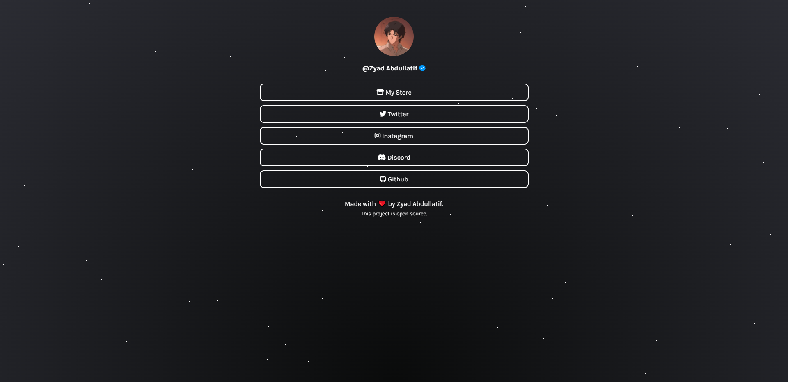

<h1 align="center">🌲 Linktree clone</h1>
<h3 align="center">Simple site to group all your profiles on social networks in one place.</h3>

  
  
  
  
  
  
  

---

  

---

## 💡 About the project

This is an open source project that serves as a free alternative to the Linktree website.
- [Check it out!](https://zyad.me)

---

Edited by [Zyad Abdullatif](https://github.com/ZyadAlnaim/linktreeclone)
Originaly made by [Jhonggli](https://github.com/johnggli)
